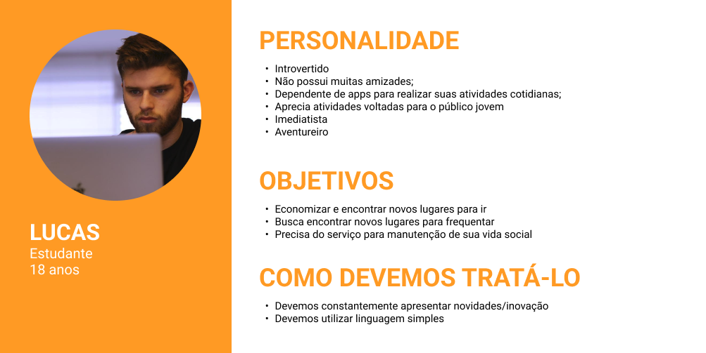
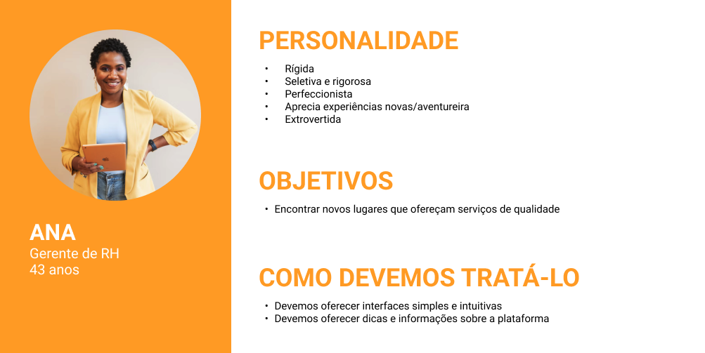
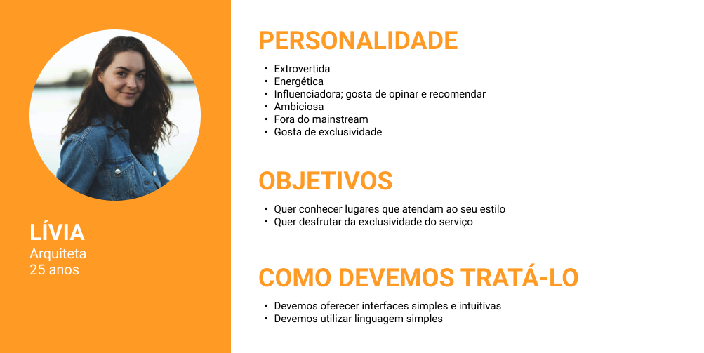
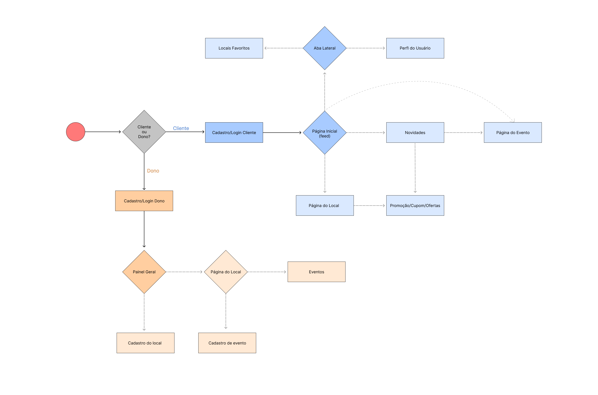

# Informações do Projeto
`TÍTULO DO PROJETO`  

## BEAGÁPP

`CURSO` 

### Engenharia de Software

## Participantes

- Daniel Leão
- Enzo Rezende
- Gabrielle Fontella
- Letícia Lott
- Matheus Pessoa
- Philippe Vieira

# Estrutura do Documento

- [Informações do Projeto](#informações-do-projeto)
  - [Participantes](#participantes)
- [Estrutura do Documento](#estrutura-do-documento)
- [Introdução](#introdução)
  - [Problema](#problema)
  - [Objetivos](#objetivos)
  - [Justificativa](#justificativa)
  - [Público-Alvo](#público-alvo)
- [Especificações do Projeto](#especificações-do-projeto)
  - [Personas e Mapas de Empatia](#personas-e-mapas-de-empatia)
  - [Histórias de Usuários](#histórias-de-usuários)
  - [Requisitos](#requisitos)
    - [Requisitos Funcionais](#requisitos-funcionais)
    - [Requisitos não Funcionais](#requisitos-não-funcionais)
  - [Restrições](#restrições)
- [Projeto de Interface](#projeto-de-interface)
  - [User Flow](#user-flow)
  - [Wireframes](#wireframes)
- [Metodologia](#metodologia)
  - [Divisão de Papéis](#divisão-de-papéis)
  - [Ferramentas](#ferramentas)
  - [Controle de Versão](#controle-de-versão)
- [**############## SPRINT 1 ACABA AQUI #############**](#-sprint-1-acaba-aqui-)
- [Projeto da Solução](#projeto-da-solução)
  - [Tecnologias Utilizadas](#tecnologias-utilizadas)
  - [Arquitetura da solução](#arquitetura-da-solução)
- [Avaliação da Aplicação](#avaliação-da-aplicação)
  - [Plano de Testes](#plano-de-testes)
  - [Ferramentas de Testes (Opcional)](#ferramentas-de-testes-opcional)
  - [Registros de Testes](#registros-de-testes)
- [Referências](#referências)

# Introdução
Muito se vivencia a dificuldade de encontrar descontos e benefícios que instiguem pessoas a visitar novos lugares, sobretudo os de entretenimento, em Belo Horizonte. Esse problema se dá em função da falta de disponibilidade de plataformas que reúnam vantagens e benefícios relacionados ao lazer, considerando aspectos críticos de qualidade. Do ponto de vista dos donos de locais, há dificuldade em atrair seu público-alvo. O projeto Beagápp busca solucionar o problema vivenciado por ambas as partes a partir de uma aplicação web.

## Problema

Falta de informações prévias sobre estabelecimentos comerciais no que se refere a cardápio, fotos do local, promoções, eventos limitados, etc.

## Objetivos

Criar uma solução baseada em web que permita aos usuários obter facilmente informações sobre locais pré-selecionados, bem como promover, para os próprios estabelecimentos, maior clientela e disponibilizar informações relevantes sobre seu público-alvo.

## Justificativa

Enquanto universitários e moradores de Belo Horizonte, não apenas sofremos com a falta de informações e descontos, como observamos ao nosso redor um grande número de pessoas que compartilham dessa dor.

## Público-Alvo

1. Universitários de BH: O app é um meio para conseguir descontos, promoções e descobrir eventos limitados.
2. Moradores de BH: O app é um meio de conhecer novos locais e novas experiências, além de potencializar o lazer e comércio na capital.
3. Donos de estabelecimentos de BH: O app é meio de promover o estabelecimento e desenvolver campanhas voltadas para um público-alvo mais disposto a consumir.
 
# Especificações do Projeto

- Miro
- Git & GitHub
- Discord
- Figma
- Forms
- R
- VSCode
- HTML, CSS e JavaScript
- Jest
- Lighthouse

## Personas e Mapas de Empatia

> 
> 
> 

## Histórias de Usuários

Com base na análise das personas forma identificadas as seguintes histórias de usuários:

|EU COMO... `PERSONA`| QUERO/PRECISO ... `FUNCIONALIDADE` |PARA ... `MOTIVO/VALOR`                 |
|--------------------|------------------------------------|----------------------------------------|
|Dono de uma casa de shows  | Obter mais dados sobre minha clientela| Direcionar melhor o marketing do meu estabelecimento               |
|Morador de Belo Horizonte       | Obter mais informações sobre cupons, ofertas e outros benefícios                 | Desfrutar de locais de forma mais acessível |
| Usuário do sistema   | Salvar meus locais favoritos   | Encontrar atividades dos locais favoritos mais facilmente |
| Usuário do sistema   | Ter um feed com novidades, como eventos limitados, promoções e convites   | Ser alertado de possíveis eventos do meu interesse |
| Dono de estabelecimento   | Divulgar benefícios para eventos e festas  | Garantir maior público |

## Requisitos

As tabelas que se seguem apresentam os requisitos funcionais e não funcionais que detalham o escopo do projeto.

### Requisitos Funcionais
#### Usuário

|ID    | Descrição do Requisito  | Prioridade |
|------|-----------------------------------------|----|
|RF-001| Permitir que o usuário se cadastre | ALTA |
|RF-002| Permitir que o usuário faça login  | ALTA |
|RF-003| Página de feed  | MÉDIA |
|RF-004| Página de novidades  | MÉDIA |
|RF-005| Página de favoritos  | MÉDIA |
|RF-006| Página de perfil  | BAIXA |
|RF-007| Mapa com a localização de eventos  | BAIXA |

#### Dono de estabelecimento
|ID    | Descrição do Requisito  | Prioridade |
|------|-----------------------------------------|----|
|RF-001| Permitir que o usuário se cadastre | ALTA |
|RF-002| Permitir que o usuário faça login  | ALTA |
|RF-003| Permitir que o usuário cadastre estabelecimentos  | ALTA |
|RF-004| Página de estabelecimentos (painel geral)  | MÉDIA |
|RF-005| Permitir que o usuário cadastre eventos no estabelecimento  | MÉDIA |

### Requisitos não Funcionais

|ID     | Descrição do Requisito  |Prioridade |
|-------|-------------------------|----|
|RNF-001| Uso de design responsivo nas interfaces gráficas | ALTA | 
|RNF-002| Deve processar requisições do usuário em no máximo 3s |  BAIXA |
|RNF-003| O sistema não deve ter nenhum custo para o usuário |  BAIXA | 
|RNF-004| O sistema deve ser acessível e ter um score de, pelo menos 90 no Lighthouse |  ALTA |
|RNF-005| O sistema deve utilizar UTF-8 |  BAIXA |

# Restrições
1. O projeto deverá ser entregue até o final do semestre;
2. Não pode ser desenvolvido com módulo de Back-end;
3. O sistema deverá ser desenvolvido apenas para web;

# Projeto de Interface

## User Flow

Link do Figma: https://www.figma.com/file/73GbzDbEFXqVZZmH5QrSfh/Beag%C3%A1pp---User-Flow

> 

## Wireframes

......  INCLUA AQUI OS WIREFRAMES DAS TELAS DA APLICAÇÃO COM UM BREVE DESCRITIVO ......

Wireframe: https://www.figma.com/file/7XzqFNmqod0aYhUHMxIWcG/Beag%C3%A1pp---Wireframes?node-id=0%3A1

> Wireframes são protótipos das telas da aplicação usados em design de interface para sugerir a
> estrutura de um site web e seu relacionamentos entre suas
> páginas. Um wireframe web é uma ilustração semelhante ao
> layout de elementos fundamentais na interface.

# Metodologia

Durante a fase de concepção, foi utilizado o método de Design Thinking para definição de ideias iniciais, delimitação do escopo e levantamento de requisitos.

Ao longo do projeto, foi utilizado o método ágil SCRUM para todas as fases de desenvolvimento.

O andamento do projeto foi realizado por meio das ferramentas internas do GitHub.

Para controle de requisitos, foi utilizado o quadro Kanbam: A fazer, Em progresso, Code Review e Feito.
## Divisão de Papéis

......  COLOQUE AQUI O SEU TEXTO ......

> Apresente a divisão de papéis e tarefas entre os membros do grupo.
>
> **Links Úteis**:
> - [11 Passos Essenciais para Implantar Scrum no seu Projeto](https://mindmaster.com.br/scrum-11-passos/)
> - [Scrum em 9 minutos](https://www.youtube.com/watch?v=XfvQWnRgxG0)

## Ferramentas

| Ambiente  | Plataforma              |Link de Acesso |
|-----------|-------------------------|---------------|
|Processo de Design Thinkgin  | Miro |  https://miro.com/app/board/uXjVOBTVCpw=/ | 
|Repositório de código | GitHub | https://github.com/ICEI-PUC-Minas-PPLES-TI/plf-es-2022-1-ti1-7924100-t2-g5-curadoria-bh | 
| Pesquisa | Google Forms | https://forms.gle/9zUHRUArSAyJrc4V9 |
|Protótipo Interativo | Figma | https://www.figma.com/file/7XzqFNmqod0aYhUHMxIWcG/Beag%C3%A1pp---Wireframes?node-id=0%3A1 | 

> As ferramentas empregadas no projeto são:
>
> - Miro
> - Git & GitHub
> - Discord
> - Figma
> - Forms
> - R
> - VSCode
> - HTML, CSS e JavaScript
> - Jest
> - Lighthouse
>

## Controle de Versão

> A ferramenta de controle de versão adotada no projeto foi o
> [Git](https://git-scm.com/), sendo que o [Github](https://github.com)
> foi utilizado para hospedagem do repositório `upstream`.
> 
> O projeto segue a seguinte convenção para o nome de branchs:
> 
> - `master`: versão estável já testada do software
> - `unstable`: versão já testada do software, porém instável
> - `testing`: versão em testes do software
> - `dev`: versão de desenvolvimento do software
> 
> Quanto à gerência de issues, o projeto adota a seguinte convenção para
> etiquetas:
> 
> - `bugfix`: uma funcionalidade encontra-se com problemas
> - `enhancement`: uma funcionalidade precisa ser melhorada
> - `feature`: uma nova funcionalidade precisa ser introduzida
>
> Em relação aos commits, o projeto adota a seguinte convenção para etiquetas:
> - `feat`: introdução de uma nova funcionalidade
> - `fix`: correção de bug
> - `docs`: atualização de documentação
> - `style`: atualizações que não afetam a funcionalidade da aplicação
> - `refactor`: refatoração de alguma funcionalidade do código
> - `perf`: melhoria de performance
> - `test`: criação de testes
> - `reverts`: reverção de um commit anterior
>

# **############## SPRINT 1 ACABA AQUI #############**

# Projeto da Solução

......  COLOQUE AQUI O SEU TEXTO ......

## Tecnologias Utilizadas

......  COLOQUE AQUI O SEU TEXTO ......

> Descreva aqui qual(is) tecnologias você vai usar para resolver o seu
> problema, ou seja, implementar a sua solução. Liste todas as
> tecnologias envolvidas, linguagens a serem utilizadas, serviços web,
> frameworks, bibliotecas, IDEs de desenvolvimento, e ferramentas.
> Apresente também uma figura explicando como as tecnologias estão
> relacionadas ou como uma interação do usuário com o sistema vai ser
> conduzida, por onde ela passa até retornar uma resposta ao usuário.
> 
> Inclua os diagramas de User Flow, esboços criados pelo grupo
> (stoyboards), além dos protótipos de telas (wireframes). Descreva cada
> item textualmente comentando e complementando o que está apresentado
> nas imagens.

## Arquitetura da solução

......  COLOQUE AQUI O SEU TEXTO E O DIAGRAMA DE ARQUITETURA .......

> Inclua um diagrama da solução e descreva os módulos e as tecnologias
> que fazem parte da solução. Discorra sobre o diagrama.
> 
> **Exemplo do diagrama de Arquitetura**:
> 
> 

# Avaliação da Aplicação

......  COLOQUE AQUI O SEU TEXTO ......

> Apresente os cenários de testes utilizados na realização dos testes da
> sua aplicação. Escolha cenários de testes que demonstrem os requisitos
> sendo satisfeitos.

## Plano de Testes

......  COLOQUE AQUI O SEU TEXTO ......

> Enumere quais cenários de testes foram selecionados para teste. Neste
> tópico o grupo deve detalhar quais funcionalidades avaliadas, o grupo
> de usuários que foi escolhido para participar do teste e as
> ferramentas utilizadas.
> 
> **Links Úteis**:
> - [IBM - Criação e Geração de Planos de Teste](https://www.ibm.com/developerworks/br/local/rational/criacao_geracao_planos_testes_software/index.html)
> - [Práticas e Técnicas de Testes Ágeis](http://assiste.serpro.gov.br/serproagil/Apresenta/slides.pdf)
> -  [Teste de Software: Conceitos e tipos de testes](https://blog.onedaytesting.com.br/teste-de-software/)

## Ferramentas de Testes (Opcional)

......  COLOQUE AQUI O SEU TEXTO ......

> Comente sobre as ferramentas de testes utilizadas.
> 
> **Links Úteis**:
> - [Ferramentas de Test para Java Script](https://geekflare.com/javascript-unit-testing/)
> - [UX Tools](https://uxdesign.cc/ux-user-research-and-user-testing-tools-2d339d379dc7)

## Registros de Testes

......  COLOQUE AQUI O SEU TEXTO ......

> Discorra sobre os resultados do teste. Ressaltando pontos fortes e
> fracos identificados na solução. Comente como o grupo pretende atacar
> esses pontos nas próximas iterações. Apresente as falhas detectadas e
> as melhorias geradas a partir dos resultados obtidos nos testes.

# Referências

- MAGALHÃES, M. N, LIMA, LIMA, A. C. P.,  2004, Noções de Probabilidade e Estatística, 6ed. Editora da Universidade de São Paulo, São Paulo.
- TRIOLA, M.G., 1999. Introdução à Esatística, 7ed . LTC, Rio de Janeiro.
- KOHONEN, T., 2001. Self-Organinzing Maps, Number 30 in Springer Series in Information Sciences, 3ed. Springer-Verlag, Berlin.
- WHRENS, R, BUYDENS, L. M. C., 2007 Self and Super-organizing Maps in R. Journal of Statistical Software, Volume 21.
- SOMMERVILLE, Ian. Engenharia de software. 10. ed. São Paulo: Pearson Education do Brasil, c2019. xii, 756 p. ISBN 9788543024974.
- BROWNE, Carmen. User Flows vs. Wireframes: What’s the Difference? 2021. Disponível em: https://careerfoundry.com/en/blog/ux-design/user-flows-vs-wireframes/. Acesso em 22 de abril de 2022.
- ALBELOP. Conventional Commits Cheat Sheet. 2018. Disponível em: https://cheatography.com/albelop/cheat-sheets/conventional-commits/. Acesso em 22 de abril de 2022.
